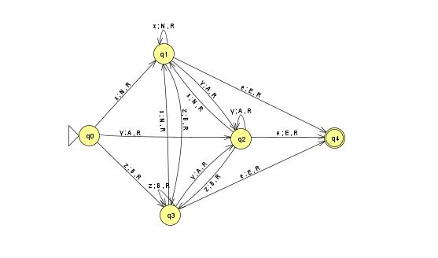

# Máquina de registros de picos de temperatura

Este código acompanha um modelo de máquina de Turing.

O intuito deste código em conjunto com o modelo é representar uma máquina que lê as temperaturas de um lugar qualquer por um determinado período de tempo (dia, mês, ano) e devolve alertas quando a temperatura estiver acima de uma temperatura máxima predeterminada ou abaixo de uma temperatura mínima predeterminada.

Esta máquina foi desenvolvida para a disciplina Teoria da Computação do curso Engenharia de Software da UPE Garanhuns, pelos alunos Eloise Sophia Lamenha Lins, Rony Rangel dos Santos Silva, e Ana Júlia Figuerêdo Bernardo.

## Modelo de máquina de Turing

q0: Estado inicial, recebe a sequência de temperaturas.  
q1: Estado para temperaturas normais (min < temp < max).  
q2: Estado de alerta para temperaturas altas (temp > max).  
q3: Estado de alerta para temperaturas baixas (temp < min).  
q4: Estado final, processa a sequência quando o símbolo "e" é encontrado.  

x: Temperatura normal (mínima < temp < máxima).  
y: Temperatura acima do limite superior (temp > máxima).  
z: Temperatura abaixo do limite inferior (temp < mínima).  
e: Marca o fim da entrada, sem mais registros de temperatura.  
N: Ação para temperaturas normais (nenhum alerta).  
A: Alerta para temperaturas altas.  
B: Alerta para temperaturas baixas.  
E: Marca o fim da palavra.
